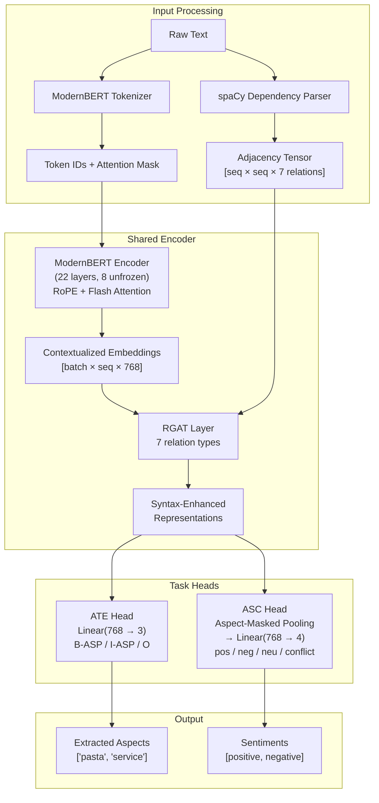

# 🏗️ Model Architecture — ModernBERT-RGAT

## Overview

The ModernBERT-RGAT architecture is a **joint model** for Aspect Term Extraction (ATE) and Aspect Sentiment Classification (ASC). It processes raw text in a single forward pass to:

1. **Extract aspect terms** using token-level BIO tagging
2. **Classify sentiment** for each extracted aspect span

---

## Architecture Diagram



---

## Component Details

### 1. ModernBERT Backbone

| Property | Value |
|----------|-------|
| Model | `answerdotai/ModernBERT-base` |
| Parameters | 149M |
| Hidden dim | 768 |
| Layers | 22 |
| Attention | Flash Attention 2 |
| Position encoding | RoPE (Rotary Position Embedding) |
| Max context | 8192 tokens |

**Why ModernBERT?** Unlike BERT (2018), ModernBERT (2024) uses:
- **RoPE** instead of absolute position embeddings → better generalization to varying lengths
- **Flash Attention** → 2x faster training with lower memory
- **Unpadding** → no wasted compute on padding tokens
- **StableAdamW** → more stable training dynamics

**Fine-tuning strategy:** Only the **top 8 of 22 layers** are unfrozen during training. This preserves pre-trained linguistic knowledge in lower layers while allowing task-specific adaptation in upper layers.

### 2. Relational Graph Attention Network (RGAT)

The RGAT layer encodes **syntactic dependency structure** as a multi-relational graph, where:
- **Nodes** = tokens (aligned to BERT subword positions)
- **Edges** = syntactic dependency relations from spaCy

```
Relation Types (7):
├── nsubj    → nominal subject
├── amod     → adjectival modifier
├── obj      → direct object
├── advmod   → adverbial modifier
├── neg      → negation
├── compound → compound words
└── conj     → conjunction
```

**Why RGAT?** Standard self-attention treats all token pairs equally. RGAT provides **structural bias** — the model knows that *"great"* modifies *"pasta"* (via `amod` relation), even if they're far apart in the sentence.

**Adjacency Tensor:** `A[i][j][r] = 1` if token `j` is connected to token `i` by relation `r`. Shape: `[seq_len × seq_len × 7]`.

### 3. ATE Head (Token Classification)

```
Hidden States [batch × seq × 768]
    → Dropout(0.4)
    → Linear(768 → 3)
    → BIO logits: O, B-ASP, I-ASP
```

- **B-ASP**: Beginning of an aspect term
- **I-ASP**: Inside an aspect term (continuation)
- **O**: Outside (not part of any aspect)

**Multi-aspect BIO labeling:** During training, BIO labels mark **all aspect terms** in the sentence simultaneously (not just the primary one). This prevents conflicting labels when the same sentence appears with different target aspects.

### 4. ASC Head (Span Classification)

```
Hidden States [batch × seq × 768]
    × Aspect Mask [batch × seq]
    → Masked Mean Pooling
    → Aspect Representation [batch × 768]
    → Dropout(0.4)
    → Linear(768 → 4)
    → Sentiment logits: positive, negative, neutral, conflict
```

The **aspect mask** isolates tokens belonging to the target aspect. Mean pooling over these tokens produces a fixed-size representation that captures the contextual meaning of the aspect within the sentence.

### 5. Joint Loss Function

```
L_total = α · L_ATE + (1 − α) · L_ASC

where:
    L_ATE = CrossEntropyLoss(ignore_index=-100, label_smoothing=0.1)
    L_ASC = CrossEntropyLoss(weight=class_weights)
    α = 0.5 (fixed, equal weighting)
```

**Design choice:** Both losses use standard CrossEntropyLoss (no focal loss) to keep magnitudes comparable. Label smoothing on ATE prevents over-confident predictions.

---

## Parameter Count

| Component | Parameters |
|-----------|-----------|
| ModernBERT encoder | ~149M (8 layers unfrozen ≈ 54M trainable) |
| RGAT layer | ~4.1M |
| ATE head | ~2.3K |
| ASC head | ~3.1K |
| **Total trainable** | **~58M** |

---

## Training Pipeline

```mermaid
flowchart LR
    A["CSV Data"] --> B["Stratified<br/>Sentence Split"]
    B --> C["ABSADataset<br/>(Multi-aspect BIO)"]
    C --> D["DataLoader<br/>(batch=4)"]
    D --> E["Forward Pass<br/>(FP16 autocast)"]
    E --> F["Joint Loss<br/>(ATE + ASC)"]
    F --> G["Backward<br/>(GradScaler)"]
    G --> H["Gradient Clip<br/>(max_norm=1.0)"]
    H --> I["Accumulate ×4<br/>(eff. batch=16)"]
    I --> J["AdamW Step<br/>(differential LR)"]
    J --> K["Linear Warmup<br/>+ Decay"]
```


